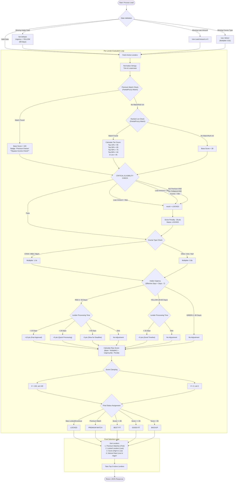

# BRE v4.0 Comprehensive Logic Flow (v2)

This diagram details the exact logic used by the `suggest-lender` Edge Function, including **Edge Cases** and **Null Handling**.

## Edge Case Handling Table

| Scenario | Handling Logic | Outcome |
| :--- | :--- | :--- |
| **Missing University Name** | Treated as "Not in Ranked List" | **Base Score = 30**. No Premium Match possible. |
| **University Name Mismatch** | `includes()` Check (Partial Match) | Matches "Oxford" with "University of Oxford". |
| **Missing Intake Date** | Defaults to `YELLOW` Zone | Assumes matching is for standard timeline (60 days out). |
| **Missing Course Type** | Defaults to "Other" | **0.8x Multiplier** applied (conservative scoring). |
| **Null Loan Amount** | Uses 0 | Likely triggers `Loan Amount < Min` lockout if lender has min limit. |
| **Processing Time Unknown** | Uses Default (20 Days) | Neutral urgency score (no bonus/penalty). |
| **Score Overflow** | Clamped at 100 | Prevents scores like 115 if Lender is Premium + Fast. |
| **Score Underflow** | Clamped at 0 | Prevents negative scores if Locked + Slow. |
